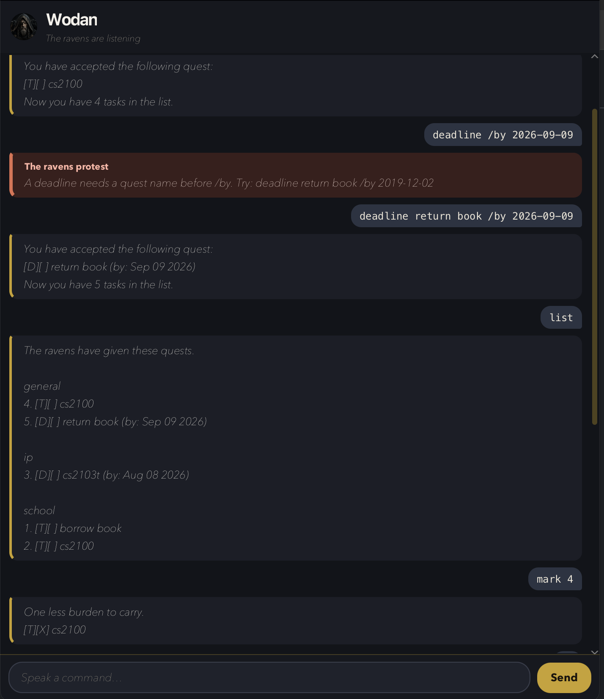

# Wodan User Guide

**Wodan** is a desktop chatbot for keeping track of todos, deadlines, and events.
You type a command; Wodan replies in the window. If you type quickly, that is often
faster than clicking through menus.

Wodan calls your tasks *quests*. The ravens remember them between sessions.



- [Quick start](#quick-start)
- [Features](#features)
  - [Adding a todo: `todo`](#adding-a-todo-todo)
  - [Adding a deadline: `deadline`](#adding-a-deadline-deadline)
  - [Adding an event: `event`](#adding-an-event-event)
  - [Listing all quests: `list`](#listing-all-quests-list)
  - [Marking a quest as done: `mark`](#marking-a-quest-as-done-mark)
  - [Marking a quest as not done: `unmark`](#marking-a-quest-as-not-done-unmark)
  - [Deleting a quest: `delete`](#deleting-a-quest-delete)
  - [Finding quests: `find`](#finding-quests-find)
  - [Viewing quests on a date: `on`](#viewing-quests-on-a-date-on)
  - [Tagging a quest: `tag`](#tagging-a-quest-tag)
  - [Exiting: `bye`](#exiting-bye)
  - [When Wodan refuses a command](#when-wodan-refuses-a-command)
  - [Saving the data](#saving-the-data)
  - [Editing the data file](#editing-the-data-file)
- [Dates and times](#dates-and-times)
- [FAQ](#faq)
- [Command summary](#command-summary)

## Quick start

1. Ensure that **Java 25** (or later) is installed.
2. Download the latest `wodan.jar` from the
   [GitHub releases page](https://github.com/AndreLiu1225/ip/releases).
3. Copy the file to the folder you want to use as Wodan's home folder.
   Wodan will create a `data` folder there for your quests.
4. Open a terminal, `cd` to that folder, and run:

   ```bash
   java -jar wodan.jar
   ```

   The Wodan window should appear in a few seconds.
5. Type a command in the box at the bottom and press **Enter** (or click **Send**).
   Try:

   - `todo borrow book` — adds a todo
   - `list` — shows every quest
   - `bye` — closes Wodan

6. See [Features](#features) for the full command list.

Wrong commands are shown as rust-coloured error cards (caption: *The ravens protest*).
You can resize the window; long replies wrap to the new width.

## Features

**Notes about the command format:**

- Words in `UPPER_CASE` are parameters you replace. For example, in `todo DESCRIPTION`,
  replace `DESCRIPTION` with `borrow book`.
- Command words are case-insensitive: `todo`, `Todo`, and `TODO` are the same.
- Extra words after commands that take no parameters (`list`, `bye`) are ignored.
- `mark`, `unmark`, and `delete` take **only** the quest number. Extra words are refused.
- Task numbers (`INDEX`) are the **1-based numbers shown by `list`**. They stay the same
  even when `list` groups quests under category headings.
- Do not use `|` in a description, date, or tag. Wodan reserves that character for the save file.
- Repeated or unexpected date markers (`/by`, `/from`, `/to`) are refused. See
  [When Wodan refuses a command](#when-wodan-refuses-a-command).

### Adding a todo: `todo`

Adds a todo with no date.

Format: `todo DESCRIPTION`

Examples:

- `todo borrow book`
- `todo read the eddas`

Expected reply:

```
You have accepted the following quest:
    [T][ ] borrow book
 Now you have 1 task in the list.
```

`[T]` means todo. `[ ]` means not done yet.

A todo has no date. Leave out `/by`, `/from`, and `/to`. Adding the same todo again
(same description) is refused.

### Adding a deadline: `deadline`

Adds a quest that must be finished by a given date (and optional time).

Format: `deadline DESCRIPTION /by WHEN`

- `WHEN` is a [date or date-time](#dates-and-times).
- The description must come before `/by`.
- Use `/by` once. Do not use `/from` or `/to` on a deadline.
- Adding the same deadline again (same description and due time) is refused.

Examples:

- `deadline return book /by 2019-12-02`
- `deadline submit iP /by 2/12/2019 1800`

Expected reply:

```
You have accepted the following quest:
    [D][ ] return book (by: Dec 02 2019)
 Now you have 2 tasks in the list.
```

`[D]` means deadline. If you included a time, it is shown as well, for example
`(by: Dec 02 2019, 6:00pm)`.

### Adding an event: `event`

Adds a quest with a start and an end.

Format: `event DESCRIPTION /from START /to END`

- `START` and `END` are each a [date or date-time](#dates-and-times).
- Use `/from` and `/to` once each. Do not use `/by` on an event.
- If you give a clock time, the end must be **after** the start. A date-only event
  may start and end on the same calendar day.
- Adding the same event again (same description, start, and end) is refused.

Examples:

- `event project meeting /from 2019-12-02 1400 /to 2019-12-02 1600`
- `event camp /from 2019-12-02 /to 2019-12-04`

Expected reply:

```
You have accepted the following quest:
    [E][ ] project meeting (from: Dec 02 2019, 2:00pm to: Dec 02 2019, 4:00pm)
 Now you have 3 tasks in the list.
```

`[E]` means event.

### Listing all quests: `list`

Shows every quest, grouped by tag.

Format: `list`

- Untagged quests appear first, under `general`.
- Other tags follow in A–Z order.
- The numbers are the original list numbers, so `mark 2` still means the second quest
  you added, not the second line under a heading.

Example:

```
The ravens have given these quests.

general
 4. [T][ ] cs2100
 5. [D][ ] return book (by: Sep 09 2026)

school
 1. [T][ ] borrow book
 2. [T][ ] cs2100
```

An empty list still prints the header and nothing else.

### Marking a quest as done: `mark`

Marks the quest at `INDEX` as done and saves.

Format: `mark INDEX`

- `INDEX` must be a positive integer shown by `list`.
- Do not add extra words after the number. `mark 1 now` is refused.

Examples:

- `list` followed by `mark 1` marks the first quest.

Expected reply:

```
One less burden to carry.
 [T][X] borrow book
```

`[X]` means done.

### Marking a quest as not done: `unmark`

Marks the quest at `INDEX` as not done and saves.

Format: `unmark INDEX`

- Do not add extra words after the number.

Examples:

- `unmark 1`

Expected reply:

```
The ravens retract their approval.
 [T][ ] borrow book
```

### Deleting a quest: `delete`

Removes the quest at `INDEX` and saves. Later quests keep their remaining numbers after a
fresh `list`.

Format: `delete INDEX`

- Do not add extra words after the number.

Examples:

- `list` followed by `delete 2` deletes the second quest.

Expected reply:

```
Noted. I've removed this task:
   [T][ ] borrow book
 Now you have 2 tasks in the list.
```

### Finding quests: `find`

Shows quests whose **description** contains the given text.

Format: `find KEYWORD`

- Matching ignores letter case: `find BOOK` matches `borrow book`.
- The whole phrase after `find` is one keyword. `find borrow book` looks for the
  substring `borrow book`, not the two words separately.
- Dates, type letters (`T` / `D` / `E`), and tags are not searched.
- The result list is numbered from 1 for reading only.
  **Use `list` numbers** with `mark`, `unmark`, `delete`, and `tag`.

Examples:

- `find book`
- `find meeting`

If something matches:

```
Here are the matching tasks in your list:
1. [T][ ] borrow book
```

If nothing matches: `The ravens found no matching quests.`

### Viewing quests on a date: `on`

Shows deadlines due on that calendar date, and events that cover it.

Format: `on DATE`

- `DATE` is a [date](#dates-and-times) (a time of day, if you include one, is ignored).
- Todos never appear, because they have no date.
- An event matches every day from its start date through its end date, inclusive.
- Numbers are the same as on `list`, so you can `mark` or `delete` from this view.

Examples:

- `on 2019-12-02`
- `on 2/12/2019`

```
The ravens found these quests on Dec 02 2019.

2. [D][ ] return book (by: Dec 02 2019)
3. [E][ ] project meeting (from: Dec 02 2019, 2:00pm to: Dec 02 2019, 4:00pm)
```

If nothing matches: `The ravens found no quests on Dec 02 2019.`

### Tagging a quest: `tag`

Puts a quest into a category. `list` then groups by that name.

Format: `tag INDEX NAME`

- `NAME` is stored in lowercase, so `School` and `school` are the same tag.
- New quests start in `general`.
- `tag 1 general` moves a quest back to `general`.

Examples:

- `tag 1 school`
- `tag 2 ip`

Expected reply:

```
The ravens branded this quest school.
 [T][ ] borrow book
```

### Exiting: `bye`

Saves nothing extra (quests are already saved after each change) and closes Wodan.

Format: `bye`

Expected reply: `So it is written. Farewell, wanderer.`

The window closes shortly after that message.

### When Wodan refuses a command

Refused commands show as rust-coloured error cards. The list does not change.

| Situation | What to do |
| --- | --- |
| Same quest already on the list (same type, description, and dates) | Change the name or times, or `list` to find the existing quest |
| `/by` on a todo, or `/from` / `/to` on a deadline, or `/by` on an event | Use only the markers for that command |
| `/by`, `/from`, or `/to` written twice | Write each marker once |
| Extra words after `mark`, `unmark`, or `delete` | Send only the command and the number, for example `mark 1` |
| Timed event whose end is not after its start | Use a later end time |
| Empty or unknown command | Use a command from [Command summary](#command-summary) |
| Missing name, date, or number | Follow the `Try: …` hint in the error card |

Spaces at the start or end of a line, and repeated spaces in the middle, are collapsed
before the command is read.

### Saving the data

Wodan saves after every command that changes quests (`todo`, `deadline`, `event`,
`mark`, `unmark`, `delete`, `tag`). You do not need a save command.

The file is `[folder you ran the JAR from]/data/wodan.txt`.

On the next launch, Wodan loads that file. If some lines are corrupted, readable quests
are still loaded and Wodan warns that the ravens skipped the rest.

If the save path is not a writable file (for example it is a folder, or the ravens
are denied access), Wodan reports the problem and does not update the list on disk.

### Editing the data file

Advanced users can edit `data/wodan.txt` directly. Each line is one quest, fields
separated by ` | `:

- Todo: `T | 0 | borrow book | general`
- Deadline: `D | 1 | return book | 2019-12-02 | school`
- Event: `E | 0 | meeting | 2019-12-02T14:00 | 2019-12-02T16:00 | general`

`0` means not done; `1` means done. Dates use ISO form (`2019-12-02` or
`2019-12-02T14:00` when a time was given).

> **Caution:** If a line is invalid, Wodan skips it on the next launch. Back up the file
> before editing it.

## Dates and times

These formats are accepted for `/by`, `/from`, `/to`, and `on`:

| Kind | Format | Example | Meaning |
| --- | --- | --- | --- |
| Date | `yyyy-MM-dd` | `2019-12-02` | 2 December 2019 |
| Date | `d/M/yyyy` | `2/12/2019` | 2 December 2019 (day/month/year) |
| Date and time | add `HHmm` or `HH:mm` | `2019-12-02 1800` | 6:00pm on that day |

Impossible dates such as 30 February are rejected.

Wodan prints dates as `Dec 02 2019`, and times in 12-hour form such as `6:00pm`.

## FAQ

**How do I transfer my quests to another computer?**
Install Wodan on the other computer, run it once so it creates a `data` folder, then
replace that `data/wodan.txt` with the file from your old computer.

**Where should I run the JAR?**
Run it from the folder you want as Wodan's home. The save file is created relative to
the working directory, not inside the JAR.

**Why did `mark 1` change the wrong quest after `find`?**
`find` numbers its own result list from 1. `mark`, `unmark`, `delete`, and `tag` always
use the numbers from `list` (and from `on`). Run `list` before those commands if you
are unsure.

**Why was my new quest refused?**
Wodan will not record a second copy of the same quest. Type, description, and dates
must all match for it to count as a duplicate; done status and tag are ignored.
See [When Wodan refuses a command](#when-wodan-refuses-a-command).

**Why did `mark 1 extra` fail?**
`mark`, `unmark`, and `delete` take only the quest number. Extra words are treated as
a mistake, not as a comment.

## Command summary

| Action | Format | Example |
| --- | --- | --- |
| Add a todo | `todo DESCRIPTION` | `todo borrow book` |
| Add a deadline | `deadline DESCRIPTION /by WHEN` | `deadline return book /by 2019-12-02` |
| Add an event | `event DESCRIPTION /from START /to END` | `event meeting /from 2019-12-02 1400 /to 2019-12-02 1600` |
| List quests | `list` | `list` |
| Mark done | `mark INDEX` | `mark 2` |
| Mark not done | `unmark INDEX` | `unmark 2` |
| Delete | `delete INDEX` | `delete 3` |
| Find | `find KEYWORD` | `find book` |
| Quests on a date | `on DATE` | `on 2019-12-02` |
| Tag | `tag INDEX NAME` | `tag 1 school` |
| Exit | `bye` | `bye` |
